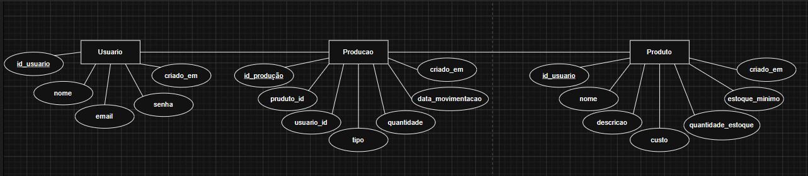
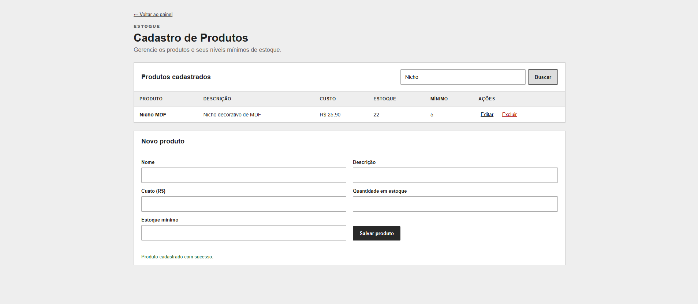
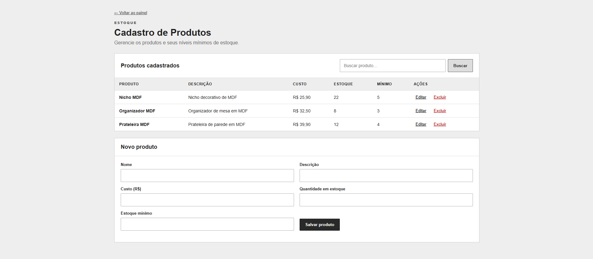
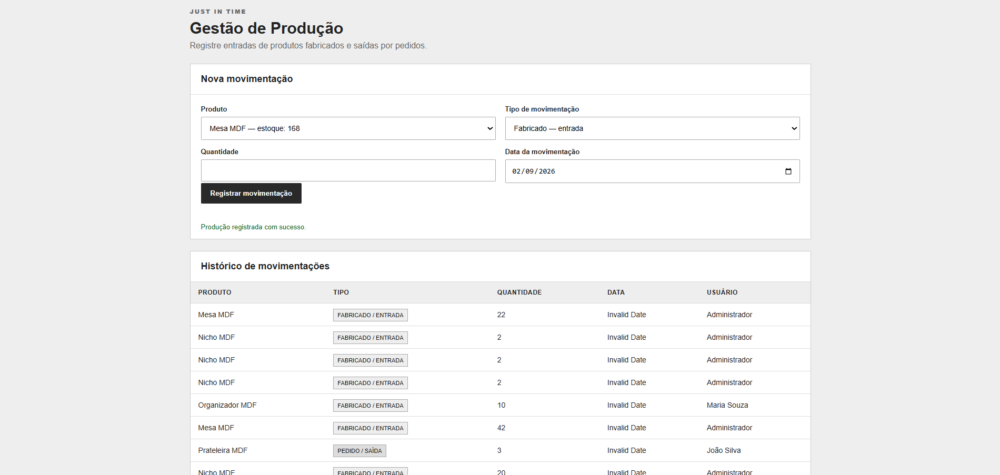
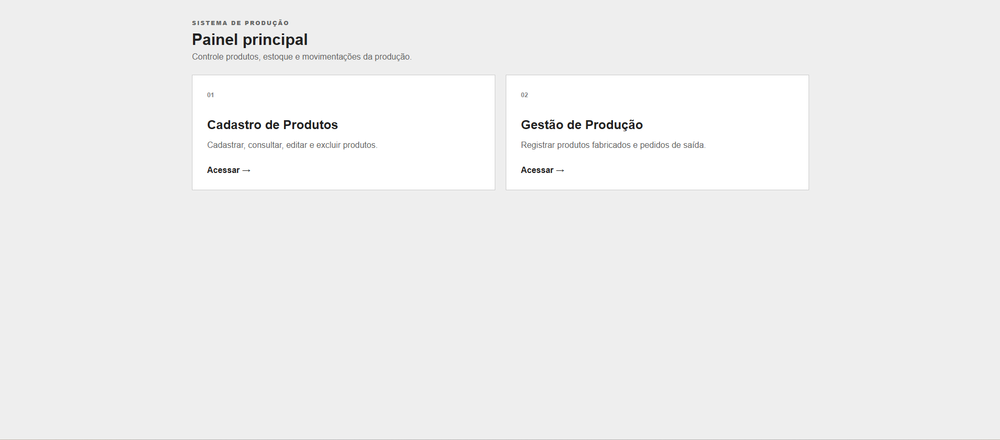
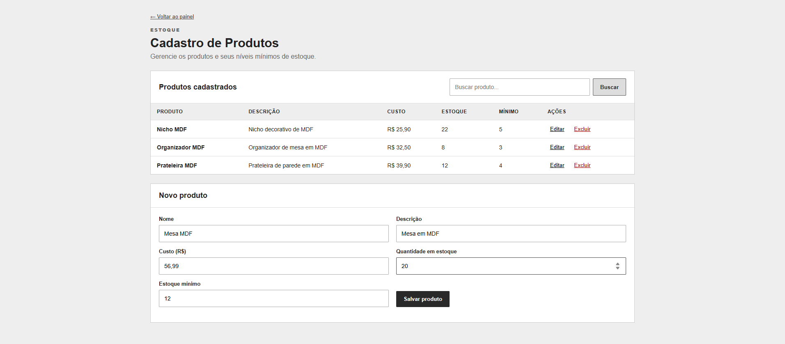

# Sistema Just in Time — Gestão da Produção

Sistema Web Full Stack para gerenciamento de produtos, estoque, pedidos e produção de uma fábrica de produtos em MDF.

## Tecnologias
- Node.js 22+
- Express.js
- MySQL 8+
- HTML5, CSS3 e JavaScript
- mysql2
- express-session
- bcryptjs

## Banco
Nome: `preparacao_db`

## Como executar

1. Instale o Node.js e MySQL.
2. Entre na pasta "backend":
   "bash
   cd backend
   npm install
   "
3. Crie o banco executando "database/preparacao_db.sql" no MySQL/phpMyAdmin.
4. Copie ".env.example" para ".env" e ajuste usuário/senha do MySQL.
5. Inicie:
   "bash
   npm start
   "
6. Acesse no navegador:
   `http://localhost:3000`

## Usuário para teste
- Email: "admin@justintime.com"
- Senha: "123456"

## Estrutura
- "backend/" API, autenticação e servidor
- "frontend/" interfaces
- "database/" script SQL
- "docs/" documentação, requisitos, casos de teste e DER

## Print do DER

## Print da Interface e do Funcionamento

-

-

-

-

